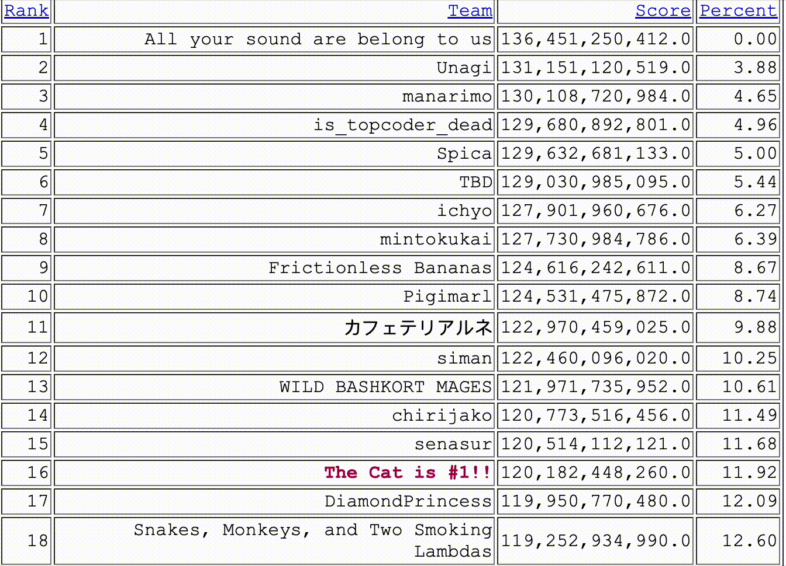

# The Cat is #1!! ICFP 2023

## Project Structure

Most of our code is written in C#, with some support from Python.

### ConsoleRunner

Runs solvers from the command line. Quite hacked up for various purposes.

### Lib

Has most of the interesting code. Solvers and the shared code that handles parsing problems and submitting solutions. Some utility functions too.

### Squigglizer

GUI runner. Render problems, shows meta data and can run solvers. Can be fun to watch.

### How to Build/Run

1. Open ICFP2023.sln in Visual Studio
2. Build all
3. Run Squigglizer
4. Pick Problem
5. Pick solver
6. Click Run
7. ???
8. Concert!

## Major approaches

FILL THIS IN

## Support stuff

We're kind of a competetive lot and really enjoy seeing how we're doing in real time. To facilitate that, we build our own scoreboard so we could see places below 10:

There's also a page tabling all the problems with a bunch of random metadata about all the problems.

PNG

As well as a page per problem so we could see how submissions were doing:

GIF
