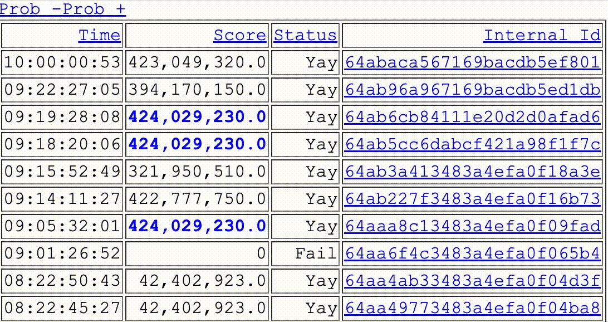

[//]: # (View the current updated version of this readme at https://github.com/thecatisnumber1/icfp2023)

# The Cat is #1!! ICFP 2023

## Project Structure

Most of our code is written in C#, with some support from Python.

### ConsoleRunner

Runs solvers from the command line. Quite hacked up for various purposes.

### Lib

Has most of the interesting code. Solvers and the shared code that handles parsing problems and submitting solutions. Some utility functions too.

### Squigglizer

GUI runner. Render problems, shows meta data and can run solvers. Can be fun to watch.

### How to Build/Run

1. Open ICFP2023.sln in Visual Studio
2. Build all
3. Run Squigglizer
4. Pick Problem
5. Pick solver
6. Click Run
7. ???
8. Concert!

## Major approaches

### Simulated Annealing

This is all we did. However a naive implementation of the scoring function was too slow for annealing to be useful. To get around this we made a major simplification to the problem. Most of our annealers weren't able to move musicians by tiny amounts. Instead they worked off of a fixed set of points, often called slots in our codebase. A musician could be moved from one slot to another by the anealer but the slots themselves could not move. We were able to speed up scoring by precomputing line of sight with the pessimistic assumption that every slot would be filled. In reallity there were many more slots than musicians but since slots closer to audience members were more valuable, they'd tend to always be filled up anyway. The downside with this approach was that if the slots were chosen badly (or even slightly unoptimally) there was nothing the annealer could do to fix it. We tried a number of different way's to intelligently place slots.

#### Let's get crackin

This approach used dynamic programming to open up small cracks in the front row enabling one more musician to sing to a VIP. It was primarily useful for problems that didn't use the playing together bonus since it only placed a small number of people on the edge. The leftover musicians were dumped in the center were they couldn't do anything. 

#### Honeycomber

This just placed hexagonal grids along the the 4 sides to best take advantage of playing together. We really should have combined this with let's get crackin, but we never did.

#### Lens Crafter

This organized many musicians around one VIP to milk them for as many points as possible. VIPs Tended to be close to the stage which meant that the lens had significant curvature which disrupted packing other musicians tightly with them. We never solved the problem of how to pack musicans to either side of the lens and have more circular rows behind the lens. One of the inspirations behind focusing a lens on a VIP was this comic: [https://www.smbc-comics.com/comic/2012-04-03](https://www.smbc-comics.com/comic/2012-04-03). We really wanted to make Felix happy.

## Support stuff

We're kind of a competetive lot and really enjoy seeing how we're doing in real time. To facilitate that, we build our own scoreboard so we could see places below 10:

There's also a page tabling all the problems with a bunch of random metadata about all the problems. This was really useful because it allowed us to focus our time studying the problems that could give us the most points. We never got stuck trying to figure out how to get points on problem 16 for example because we knew it would never matter.

As well as a page per problem so we could see how submissions were doing:

All of these were sortable, mostly for copy and paste reasons.
